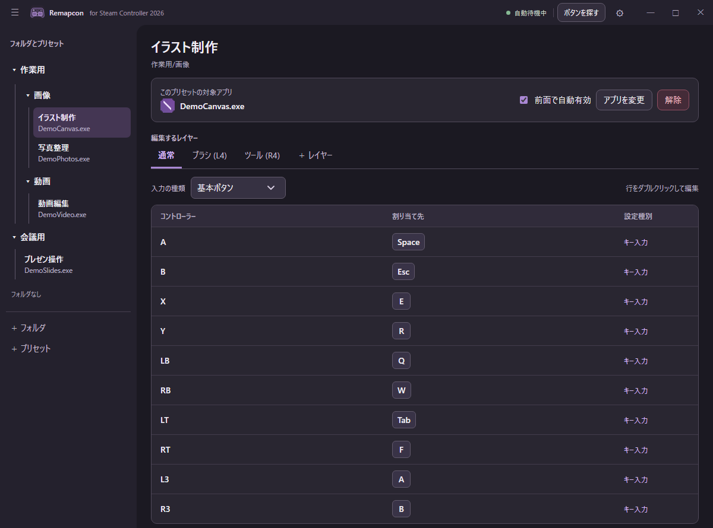

# Remapcon

2026年版Steam Controllerのボタンやスティック、トラックパッドの操作を、キーボードやマウスの入力に変換するWindowsアプリです。Puck経由の接続にも対応しています。

## 作った理由

普段はSteam Inputの設定で十分です。ただ、自分の環境では、別のランチャーから起動したアプリに合わせて設定が切り替わらず、意図しないキー入力が混ざることがありました。そこで、コントローラーの入力を直接読み取り、指定したアプリが前面にあるときだけ割り当てを有効にするRemapconを作りました。

## できること

- 対象アプリごとにプリセットを作り、フォルダで整理する
- ボタン、右スティックの各方向、左右トラックパッドの操作を設定する
- レイヤーの切り替え、連打、複数キーの連続入力を設定する
- 対象アプリが前面にあるとき、プリセットを自動で有効にする
- プリセットをJSON形式でインポート・エクスポートする

## 画面イメージ



## 使い始める

[Releases](https://github.com/ro-ba/remapcon/releases)から`Remapcon-Windows-x64.zip`をダウンロードします。ZIPを展開し、フォルダ内の`Remapcon.exe`を起動してください。インストールは不要です。

Windows 10/11と2026年版Steam Controllerが必要です。[Microsoft Edge WebView2 Runtime](https://developer.microsoft.com/microsoft-edge/webview2/)や[Visual C++ 再頒布可能パッケージ（x64）](https://learn.microsoft.com/ja-jp/cpp/windows/latest-supported-vc-redist)が入っていない場合は、別途インストールしてください。

1. Steamがコントローラーを使用している場合は、Steamを終了します。
2. Remapconでプリセットを作成し、「アプリを変更」から対象アプリを指定します。
3. 割り当てを変更したい行をダブルクリックします。「前面で自動有効」をオンにすると、対象アプリを操作している間だけプリセットが有効になります。

対象アプリを管理者として実行している場合は、Remapconも管理者として実行してください。

更新するには、設定画面の「更新を確認」を押します。新しい版があれば「更新して再起動」からダウンロードできます。ZIPのSHA-256を照合してからアプリを終了し、ファイルを置き換えて再起動します。配置先に書き込み権限がない場合は、Windowsの管理者権限の確認が表示されます。v1.1.1以前からの更新だけは、最初に最新版のZIPを手動で展開してください。

## ソースからビルド

Visual Studioの「C++によるデスクトップ開発」、Windows SDK、CMake 3.20以上が必要です。CMakeの初回実行時にWebView2 SDKをダウンロードします。

```bat
cmake -S . -B build -G "Visual Studio 18 2026" -A x64
cmake --build build --config Release --target Remapcon
```

実行ファイルは`build\Release\Remapcon.exe`に生成されます。ライセンス文書を含む配布用ZIPは`cpack --config build\CPackConfig.cmake -C Release -G ZIP`で作成できます。

## ライセンス

[SteamlessController](https://github.com/ddeverill/SteamlessController)のHID通信・コントローラー制御コードを利用しています。元コードもRemapconもMITライセンスです。詳しくは[LICENSE](LICENSE)と[第三者の権利表示](THIRD_PARTY_NOTICES.md)を参照してください。

RemapconはValve Corporationとは無関係の非公式アプリです。SteamとSteam ControllerはValve Corporationの商標です。
