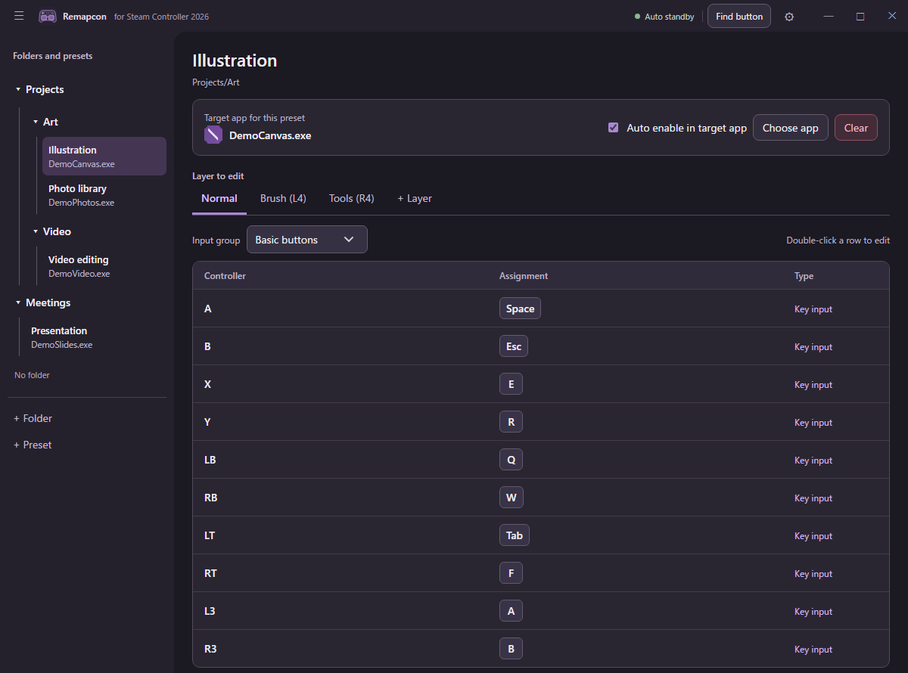

# Remapcon

A Windows app for mapping the 2026 Steam Controller / Puck to keyboard and mouse input.

[日本語の説明](README.ja.md)

## Why I built it

Steam Input is usually enough. In my setup, it could not reliably track an app launched through a separate launcher, and Desktop Layout or Lizard Mode input could overlap with the intended mapping. Remapcon reads the controller directly and maps its input for the app you choose.

## Features

- Per-app presets organized in folders
- Independent D-pad and left/right stick direction mappings; trackpad movement, tap, and press actions with movement and press haptics
- Layers, turbo, and key sequences
- Automatic activation while the target app is in the foreground
- JSON import and export

## Screenshot



## Getting started

Download `Remapcon-Windows-x64.zip` from [Releases](https://github.com/ro-ba/remapcon/releases), extract it, and run `Remapcon.exe` from the extracted folder. There is no installer.

You need Windows 10/11 and a 2026 Steam Controller / Puck. Install the [Microsoft Edge WebView2 Runtime](https://developer.microsoft.com/microsoft-edge/webview2/) and [Visual C++ Redistributable (x64)](https://learn.microsoft.com/en-us/cpp/windows/latest-supported-vc-redist) if your PC does not already have them.

1. Close Steam if it is using the controller.
2. Create a preset and use **Choose app** to select the target executable.
3. Double-click a mapping row to edit it. Turn on **Auto enable in target app** to activate the preset while that app is in the foreground.

If the target app runs as administrator, run Remapcon as administrator too.

To update, select **Check for updates** in Settings. If a newer release is available, choose **Update and restart**. Remapcon verifies the ZIP's SHA-256, exits, replaces its files, and restarts. Windows may request administrator permission if the app folder is not writable. Users of v1.1.1 or earlier need to extract the new ZIP manually once to get the updater.

## Build from source

Install Visual Studio with Desktop development with C++, the Windows SDK, and CMake 3.20 or newer. CMake downloads the WebView2 SDK on first configure.

```bat
cmake -S . -B build -G "Visual Studio 18 2026" -A x64
cmake --build build --config Release --target Remapcon RemapconUpdater
```

The executable is `build\Release\Remapcon.exe`. To package it with license files, run `cpack --config build\CPackConfig.cmake -C Release -G ZIP`.

## License

Remapcon uses HID and controller communication code from [SteamlessController](https://github.com/ddeverill/SteamlessController). The original code and Remapcon are MIT-licensed; see [LICENSE](LICENSE) and [third-party notices](THIRD_PARTY_NOTICES.md).

Remapcon is an unofficial app independent of Valve Corporation. Steam and Steam Controller are trademarks of Valve Corporation.
