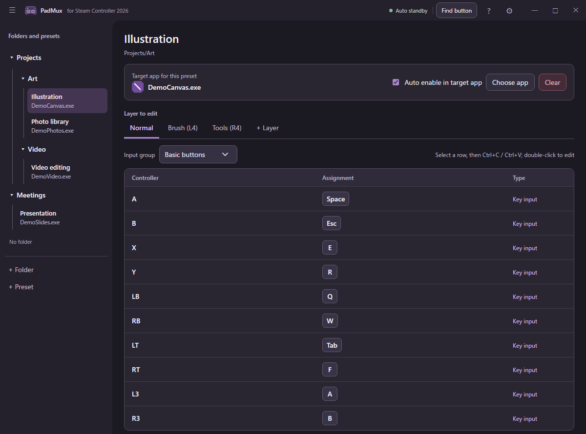

# PadMux

PadMux means **Pad + Multiplexer (Mux)**: controller input is selected, mapped and routed to keyboard, mouse or future output types.

`Controller → PadMux → Keyboard / Mouse / other outputs`

Launching an app through another launcher, only to find that your Steam Input layout did not switch? Getting unintended input from the Desktop Layout? PadMux helps you use the 2026 Steam Controller with the mapping you want for the app in front of you.

It reads the controller directly and maps buttons, sticks, and trackpads to keyboard and mouse input. A preset can activate automatically while its target app is in the foreground. Puck connections are supported.

[日本語の説明](README.ja.md)

## Why I built it

Steam Input is usually enough. In my setup, it could not reliably track an app launched through a separate launcher, and Desktop Layout or Lizard Mode input could overlap with the intended mapping. I built PadMux so I could bring that app to the foreground and use the keyboard and mouse mapping I intended.

It is also useful for apps you want to control with keyboard and mouse bindings rather than gamepad input. PadMux does not create a virtual Xbox controller.

## Features

- Per-app presets organized in folders
- Independent D-pad and left/right stick direction mappings; trackpad movement, tap, and press actions with movement and press haptics
- Adjustable deadzones and diagonal overlap for each stick, with a live response preview
- Layers, turbo, and key sequences
- Copy and paste a settings row across buttons, layers, or presets with Ctrl+C / Ctrl+V
- Navigate presets, layers, and input rows with the keyboard; open the shortcut list with the top-right **?** button or F1
- Automatic activation while the target app is in the foreground
- Optional exclusive handoff while Steam is running: PadMux takes the controller for the target app and returns it to Steam when you leave (requires administrator privileges)
- JSON import and export

## Screenshot



## Getting started

Download `padmux-windows-x64.zip` from [Releases](https://github.com/ro-ba/padmux/releases), extract it, and run `padmux.exe` from the extracted folder. There is no installer.

You need Windows 10/11 and a 2026 Steam Controller / Puck. Install the [Microsoft Edge WebView2 Runtime](https://developer.microsoft.com/microsoft-edge/webview2/) and [Visual C++ Redistributable (x64)](https://learn.microsoft.com/en-us/cpp/windows/latest-supported-vc-redist) if your PC does not already have them.

1. If Steam is using the controller, close Steam or configure **Use alongside Steam** below.
2. Create a preset and use **Choose app** to select the target executable.
3. Double-click a mapping row to edit it. Select a row and press Ctrl+C / Ctrl+V to copy its settings to another row. Turn on **Auto enable in target app** to activate the preset while that app is in the foreground.

For keyboard navigation, press Alt+1/2/3 to focus presets, layers, or input rows. F2 renames, Delete removes an item or resets an input row, and Ctrl+Z undoes a settings change. The top-right **?** button lists all shortcuts.

If the target app runs as administrator, run PadMux as administrator too.

### Use alongside Steam

Run PadMux as administrator and turn on **Auto enable in target app**. In Settings, enable **Take exclusive control while the target app is in front**. PadMux then uses your bindings while the target app is in front and returns the controller to Steam when you leave. **Find button** also takes temporary control while it is active. Windows reconnects the controller during each switch. You do not need to change Steam's Desktop Layout.

This is an experimental feature for the 2026 Steam Controller. Switching to a target app and back to Steam's Desktop Layout has been confirmed on a physical controller. Returning to Steam games and every connection type have not been verified. See the [handoff investigation](docs/steam-coexistence-investigation.ja.md) for details.

## Build from source

Install Visual Studio with Desktop development with C++, the Windows SDK, and CMake 3.20 or newer. CMake downloads the WebView2 SDK on first configure.

```bat
cmake -S . -B build -G "Visual Studio 18 2026" -A x64
cmake --build build --config Release --target padmux padmux-updater
```

The executable is `build\Release\padmux.exe`. To package it with license files, run `cpack --config build\CPackConfig.cmake -C Release -G ZIP`.

## License

PadMux uses HID and controller communication code from [SteamlessController](https://github.com/ddeverill/SteamlessController). The original code and PadMux are MIT-licensed; see [LICENSE](LICENSE) and [third-party notices](THIRD_PARTY_NOTICES.md).

PadMux is an unofficial app independent of Valve Corporation. Steam and Steam Controller are trademarks of Valve Corporation.

## Upgrading from Remapcon

PadMux stores settings in `%LOCALAPPDATA%\PadMux\ControllerSettings.json`. On first launch, it copies existing Remapcon settings, window placement and target icons without deleting the originals. Existing PadMux settings take priority; malformed old settings produce an error rather than being replaced. The JSON schema and filename stay compatible. WebView2 uses a fresh cache; the old browser profile is retained.

Download the new `padmux-windows-x64.zip` manually when moving from an old Remapcon release; old updaters expect the previous executable and ZIP names. Close the old app before launching PadMux. [Rename and compatibility details](docs/padmux-rename.ja.md).
