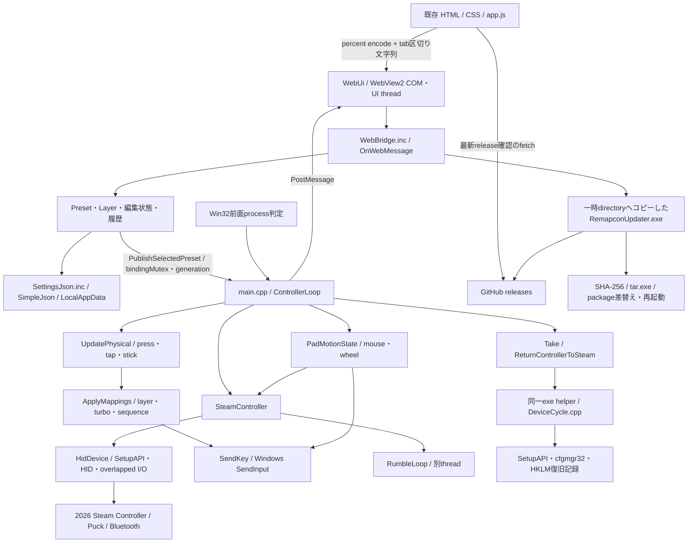

# Remapcon Rust migration — Phase 0 調査

> この文書は改名前のRemapconで実施した調査・試験の記録です。旧名称・実行file・TEMP pathは履歴として保持します。現在の製品名はPadMuxです。[名称変更と互換性](padmux-rename.ja.md)。

調査日: 2026-10-02。reference: `f82d73cdced10bca0c2c5faac9d78c619efc9ede`（v1.7.0のソース）。
本書は調査・設計候補のみ。Rust workspace、依存追加、C++修正、UI変更、リリース変更は行っていない。

## 結論

段階的移行は可能。既存の `src/` とCMakeを維持し、別の `rust/` でWindows x64 console PoCから比較する構成が適している。
最初の依存候補はWindows境界の `windows`。protocol parserは標準ライブラリだけで実装でき、`serde` / `serde_json` とWebView2は必要なフェーズで追加する。

最大のリスクは、HID非同期I/Oの寿命・キャンセル、Steamとの排他取得競争と復旧、時間と状態に依存するmapping、既存設定・Web bridgeの細かい互換性。
Phase 2の実機合格前にmappingやGUIの大規模移植へ進まない。
「既存C++が実装する挙動」と「実機で確認済みの挙動」は分けて扱う。特にSteam handoffの全接続方式・中断復旧は現行でも検証が完了していない。

## 1. ソース一覧と責務

実装は `.cpp` 7本、関連 `.h` 7本、`.inc` 2本、合計6,028行。`main.cpp` が2,807行を占める。`.inc` は独立した翻訳単位ではなく `main.cpp` の匿名namespace内へincludeされる。

| ファイル | 行数 | 現在の責務 / 主な型・関数 |
|---|---:|---|
| `src/hid/HidDevice.h` | 66 | `HidDevice` の所有権、列挙、shared/exclusive open、adopt/reopen、I/Oインターフェース |
| `src/hid/HidDevice.cpp` | 311 | SetupAPI/HID列挙、HANDLE/event管理、caps取得、overlapped read/write、feature report |
| `src/steam/SteamController.h` | 273 | `SteamController`、VID/PID、report/button/setting定数、transport、access claim、haptics状態 |
| `src/steam/SteamController.cpp` | 514 | 接続probe、コマンド構築、Lizard/IMU/keepalive、rumble/trackpad haptics |
| `src/app/main.cpp` | 2,807 | アプリ状態、入力parse、mapping、SendInput、controller loop、前面判定、Steam切替、プリセット編集、INI移行、トレイ・window・起動終了 |
| `src/app/SettingsJson.inc` | 334 | JSON出力/検証、UTF-8入出力、snapshot、保存、旧設定移行 |
| `src/app/SimpleJson.h` | 163 | 独自JSON `Value` / `Parser`。設定とupdaterで共用 |
| `src/app/WebBridge.inc` | 633 | UI state JSON、タブ区切りcommand解析、編集/保存、row clipboard、undo/redo |
| `src/app/WebUi.h` | 24 | `WebUi` のCOMオブジェクトとmessage handler |
| `src/app/WebUi.cpp` | 100 | WebView2環境作成、NavigateToString、受信callback、PostWebMessageAsJson、resize/close |
| `src/app/DeviceCycle.h` | 4 | helper command入口 |
| `src/app/DeviceCycle.cpp` | 204 | 同一exeのhelperモード、PnP disable/enable、HKLM復旧記録、named mutex、継承event |
| `src/app/TargetIcon.h` | 7 | 対象exeのPNG data URI取得インターフェース |
| `src/app/TargetIcon.cpp` | 239 | exe探索、Shell icon抽出、WIC PNG生成、base64、fingerprint付きcache |
| `src/app/UpdateProtocol.h` | 30 | `v数字.数字.数字`検証、update通知message、失敗code |
| `src/app/Updater.cpp` | 319 | 別exe updater、WinHTTP download、BCrypt SHA-256、tar展開、終了待ち、差替え・再起動 |

追加のnative/build入力: `src/app/resources/app.rc`（icon/version）、`resource.h`、`remapcon.ico`、`remapcon.svg`、`src/app/ui_embedded.h.in`（CMake生成header template）。
維持すべきUI: `src/app/ui/index.html`、`style.css`、`app.js`。フロントエンドにnpm dependencyはない。

主なapplication型は `Preset` / `Layer` / `TurboSettings` / `SequenceSettings` / `ConfigSnapshot`、入力状態は `PadPressState` / `TapState` / `StickDirections` / `PadMotionState`、出力状態は `HeldKey` / `TurboState` / `SequenceState`。いずれも現在は `main.cpp` またはinclude内に定義される。

## 2. Architecture map



アプリ出力はkeyboard/mouseのみ。ViGEm、仮想Xbox/DS4、XInput rumbleの受信、gyro mappingは現在のアプリ経路に存在しない。
controllerクラスにIMU・rumble・dock APIがあっても、全てがRemapconから使われているわけではない。

## 3. SteamlessController由来とRemapcon独自部分

`THIRD_PARTY_NOTICES.md` に記された upstream commit
`26c5b4ab6eee8aaf57eb9c99383eed3dfe475df2` の同名4ファイルを取得し、行単位で直接比較した。

| ファイル | upstream行数 → 現在 | 比較結果 |
|---|---|---|
| `HidDevice.h` | 65 → 66 | upstream全行維持、`OpenExclusive` 宣言1行追加 |
| `HidDevice.cpp` | 302 → 311 | upstream全行維持、`OpenExclusive` 定義9行追加 |
| `SteamController.h` | 272 → 273 | upstream全行維持、`OpenExclusive` 宣言1行追加 |
| `SteamController.cpp` | 510 → 514 | upstream全行維持、delegation4行追加 |

したがって、この4ファイルの列挙、report定義、Lizard/feature/keepalive、haptics、transport、I/Oキャンセル処理は確実にupstream由来。
現在の `LICENSE` はupstream MIT本文・Dylan Deverillの2026 copyrightを全て維持し、ro-baの2026 copyrightを追加している。
出典: [upstream固定commit](https://github.com/ddeverill/SteamlessController/tree/26c5b4ab6eee8aaf57eb9c99383eed3dfe475df2)、[upstream LICENSE](https://raw.githubusercontent.com/ddeverill/SteamlessController/26c5b4ab6eee8aaf57eb9c99383eed3dfe475df2/LICENSE)。

Remapcon側で構築されたアプリ領域は、keyboard/mouse mapping、プリセット・layer・設定管理、Web UI/bridge、対象app判定、row clipboard/undo、updater、release構成。
ただし「アプリ領域だからupstreamと無関係」とは断定しない。`PadPressState` はupstream閾値を参照すると明記され、device cycle等もupstreamの類似機能と照合する余地がある。今回の厳密な差分確認は上記4ファイルとLICENSEに限定した。

Rust化でも4ファイル由来のmoduleへ出典・固定commit・MIT表示を引き継ぐ。アプリ部分も既存attributionを残す。
ルート `LICENSE`、両copyright、`THIRD_PARTY_NOTICES.md`、WebView2のlicense/noticeは維持する。Rust版release/updaterがコピーするファイル集合にも含める。

## 4. HID / protocol / controller control

### 列挙・open

- VID `0x28DE`。PID `0x1302` wired、`0x1303` BT、`0x1304` Puck、`0x1305` Nereid。
- vendor usage page `0xFF00`、controller usage `0x0001`。dockはusage `0x0002`、別APIで列挙する。2015モデルのPIDを推測追加しない。
- SetupDi列挙 → access=0のshared query handle → HidD attributes / HidP capsでfilter。列挙成功とlive input slotであることは別。
- `Open()` は `GENERIC_READ | GENERIC_WRITE`、share read/write、`FILE_FLAG_OVERLAPPED`。`OpenExclusive()` はshare readのみ。readまで排他にするshare=0とは異なる。
- live slot判定はstate report待ち。アプリは各候補350msでprobeし、最初のlive slotを使用する。複数controllerの同時mappingはない。
- `ClaimGameModeAccess()` はshare read優先、失敗時sharedへfallbackする。しかし現在の `ControllerLoop` は `Exclusive` またはtakeover成功以外を拒否する。クラスのコメントだけを見てshared状態でmappingを開始すると挙動変更になる。
- `AdoptHandle()` はupstreamから残るが現在のアプリ経路では未使用。`ReleaseToShared()` / `EnumerateDocks()` も現在のloopからは呼ばれていない。終了時はrestoreしてcloseする。

### report parse

| report / offset | 現在の定義・消費 |
|---|---|
| state `0x45` / `0x42` | 共通layout。sequence byteはoffset 1。アプリはsequence欠落検証をしていない |
| offsets 2–5 | buttons/flags。A/B/X/Y、肩、D-pad、stick click、L4/L5/R4/R5、Menu/View、pad touch/click |
| offsets 6–9 | 左右trigger signed LE i16。押下 `>0x2000`、保持 `>0x1800` |
| offsets 10–17 | 左右stick signed LE i16。18byte以上で使用 |
| offsets 18–29 | 左右pad X/Y signed LE i16、contact area u16。30byte以上で使用 |
| offsets 30–45 | IMU timestamp / accel / gyroの定義。アプリはIMUを無効化しmappingしない |
| `0x43` / `0x44` | battery/statusとして定義のみ。現在のloopは状態更新に利用しない |
| `0x7B` / `0x79` | unknownとして定義のみ。意味を推測しない |

Steam button、stick touch、grip sensorのbitsもheaderにはあるが、32項目のmapping配列には入っていない。
PoCではraw flagsとして観察できるようにするが、新しいmapping/UXを追加しない。
state reportは最低10byte、stickは18、padは30と長さを分岐する。Rustはsliceと `from_le_bytes` で安全にparseし、短いreportの扱いをC++と比較する。

transport判定はpathを小文字化し、HOGP GUID / `bthledevice` / `bthenum` をPIDより先に確認する。その後1304/1305をdongle、1302/1303をwiredへ分類する。
現行はBT専用fragment assemblerを持たず共通report parserを使う。実機未確認部分を一般的なSteam Controllerの知識で補完しない。

### feature・haptics・復帰

- command bufferは64byte zero fill、`[0x01, command, payload_size, payload...]`。headerにはfeature `0x02` fallbackが書かれているが、現行 `BuildCmd` / `SendFeatureReport` にfallback実行はない。
- feature writeはcapsの `FeatureReportByteLength` へpad/truncate。output writeは `OutputReportByteLength` より短い場合pad。feature / HidD output / interrupt `WriteFile` は別経路。
- Lizard off: digital mappings clear `0x81` → IMU mode off `0x87/0x30` → left/right pad mode NONE `0x87/0x08,0x07` → rumble thread開始。
- keepaliveは2秒ごとにclear mappingsとpad NONEを再送。失敗は通信不健全として再接続経路へ入る。
- Lizard restore: rumble thread停止/join、rumble=0、IMU off、default mappings `0x85` とdefault settings `0x8E` の両方を送る。前者だけではpad mouse復帰が遅れるというupstreamコメントがある。
- trackpad command output `0x82` はside 0=左、1=右、command 1=tick / 2=click。左右は実測に基づくコメントがあり、旧モデルの順序へ変えない。
- movement hapticは50ms rate limitでdropし、clickは優先して送る。rumble `0x80` は40ms周期再送、mix/power curve/attack boostあり。アプリにvirtual-controller rumble sourceはないが、controller実装の由来・振舞いは記録しておく。
- `EmergencyLizardRestore()` はlock/joinを避けたbest effort。現在のアプリはcontroller loopのcatchで使用し、Win32 unhandled exception filterを登録していない。

## 5. Threading / synchronization / lifecycle

| 実行主体 | 責務 / 共有境界 |
|---|---|
| UI thread（COM STA） | Win32 message loop、WebView callbacks、preset編集、設定保存、clipboard/history、icon生成 |
| controller thread | 前面判定、enumerate/open/read、入力状態、mapping、mouse出力、haptics request、handoff |
| rumble thread | Lizard off中、rumble stateを40msごとに再送 |
| device-cycle helper process | named mutexで直列化しPnP disable/enable、復旧記録、down event通知 |
| updater process | network / checksum / extract、親UI終了交渉、差替え |

UI → controllerは `bindingMutex` 下のlive設定とatomic bindings、flags (`running/requested/autoMode/previewMode/steamTakeover`)、`targetVersion`、`mappingGeneration`。
generation変更で押下を解放しturbo/sequence stateをリセットする。controller → UIは `PostMessage` でstatus/button mask/packed stick座標を送る。
HID writeは `m_writeMutex`、rumble stateは `m_rumbleMutex`。trackpad rate limit時刻はread-loop thread専用。

Rust候補は「UIが編集状態を所有」「workerがcontrollerとruntime mapping stateを所有」「設定snapshot/commandをchannelで受渡し」。`std::thread`、`std::sync::mpsc`、必要なatomicでまず十分。
ただしsnapshotのpublish順序・generation更新・foreground option切替の即時性を維持する。全てを `Arc<Mutex<App>>` にまとめたり、Tokioで時間モデルを変えたりしない。

Overlapped I/Oはtimeout時 `CancelIo` 後、`GetOverlappedResult(..., TRUE)` で完了をdrainしてからstack上の `OVERLAPPED` / bufferを破棄する。
readとreopen/closeの同時実行を許さない設計が必要。rumble writer停止/joinを含むhandle teardown順序も固定する。
終了はflagsを落としcontroller threadをjoinし、その後window/WebViewを破棄する。Rust panicをWin32/COM callback境界へunwindさせない。

## 6. Mapping / keyboard / mouse

- mapping indexは32項目の固定順序。旧JSONは28項目。この順序は設定・UI・preview maskすべての契約。
- pad pressはarea `>=1800` またはclick bit、2report連続でpress/release確定。短いreportはclick bitへfallback。
- tapはcontact解除時、200ms以下・最大移動3000以下・clickなしで50ms pulse。
- stickはradius deadzone、release側−1500 hysteresis、diagonal min axis条件、overlap+700のdiagonal保持hysteresis。signed最小値を含む計算幅を維持する。
- layerはtriggerを保持している間active。trigger button自体を通常出力しない。複数active時は配列の後のlayerが優先。inherit `0xFFFFFFFF`、off `0` は異なる。
- sequenceがturboに優先。sequence/turboはinterval前半だけ押下し、後半は解放。sequenceはrepeat / one-shot、source layer変更で開始時刻reset。turboはdelayとkey/settings変更を考慮。
- 同じoutput keyへ複数buttonが割り当てられてもreference countで共有する。layer変更時は旧key upを先に送る。SendInput失敗時のretry・status・キー解放の再試行も挙動の一部。
- continuous keyboard repeatはWindowsのkeyboard delay/speedから計算。mouse buttonはkeyboard repeat対象外。
- mouse移動は相対座標、scale `0.01125f * sensitivity/100`、wheelは `0.02f * sensitivity/100`、端数を次へ保持する。deltaの絶対値12000以上は不連続とみなしgestureを仕切り直す。
- wheel方向・水平/垂直送信順・float32の切捨てを維持する。preview時と対象appが前面でない時はmouse/mapping出力を抑制する。
- `SendKey` はvirtual keyではなくscan code下位8bit、extended flag `0x10000`、mouse codes `0x20001`–`0x20003`。SendInput 1件の戻り値で成功判定する。
- state無受信500ms超でphysical stateをclear、4秒超でreconnect。read timeoutは通常32ms、turbo/sequence armed時8ms。preview通知は40ms周期。

pure Rust engineは `input + settings + explicit time + output result` を受けてoutput intentを返す形が候補。OS側でSendInputし、成功/失敗をengineへ返すことで失敗再試行を消さない。
padの座標parseとgesture判定、mapping、mouse motion計算を分離し、Windows APIを直接呼ばないunit testが可能になる。

## 7. Config / preset / app detection

設定本体は `%LOCALAPPDATA%\Remapcon\ControllerSettings.json`。WebView dataは `Remapcon\WebView2`、window配置は別の `WindowPlacement.ini`、icon cacheは `TargetIcons`。

| 対象 | 互換性条件 |
|---|---|
| root JSON | `formatVersion:1`、language ja/en、closeBehavior 0–2、autoMode、steamTakeover、selectedPreset、folders、presets |
| preset | name/folder/targetExecutable、pad mode/sensitivity、stick deadzone/overlap、mapping/turbo/sequence、layers |
| layer | name、trigger（32は未割当sentinel）、mapping/turbo/sequence。mappingのみinherit許可 |
| old arrays | 28/32要素を受理。28の場合、左stick方向の4項目を対応するD-padのmapping/turbo/sequenceから補完 |
| optional fields | steamTakeover欠落はfalse。stick deadzone欠落12288、overlap欠落16000。その他必須項目を安易にdefault化しない |
| validation | presets 1–100、folders ≤100、layers ≤32、sequence ≤16key、interval 20–2000ms、delay ≤5000ms、sensitivity 25–400、stick値 ≤32767。string上限はUTF-16単位 |
| parser | 非負u64整数のみ、重複object key拒否、depth ≤32、array/object各≤10000、unknown fieldもparseする。未知schema fieldはReadConfigでは無視し再出力では保持しない |
| encoding/storage | strict UTF-8、入力BOM許可、8MiB制限。`.tmp` write → flush → MoveFileEx replace/write-through |
| import | 保存と `.before-import.json` backup後に適用。存在しないfull-path target解除とautoMode off。保存失敗時snapshot/requestedを復元 |
| initial migration | Remapcon JSONが無い時だけ旧 `SteamlessController\ControllerSettings.json` または `MapleStoryController.ini` から移行、window/icon cacheもコピー |

`serde` deriveだけではduplicate key/depth/整数/旧array/UTF-16長/限界値/unknown fieldの扱いが全て同じにならない。
まずwire modelとvalidationを分け、旧C++で生成したfixtureの読み込み・正規化後のsemantic round-trip・拒否ケースを比較する。
文字列・浮動小数・負数などunknown fieldの入力受理範囲も確認する。Rust serializerの空白やescape表現はbyte一致より意味を基準とするが、schema・値・配列順序は変えない。
INI移行はWindows profile APIを維持する候補。別INI crateへ移すとencoding/default解釈が変わる可能性がある。

前面判定は `GetForegroundWindow` → PID → `OpenProcess(PROCESS_QUERY_LIMITED_INFORMATION)` → `QueryFullProcessImageNameW`。
full pathなら大文字小文字を無視した全path一致、basenameならexe名一致。foreground HWND / target versionが同じ場合100ms cache。
手動requestedでもmapping出力は対象appの前面に限定。autoModeは選択中presetを有効にするだけで、他presetを走査して切り替える実装はない。
Rust移行で新しい自動preset検索を追加しない。app選択のfile dialog、exe icon探索・cache、権限状態表示も保持対象。

## 8. Steam coexistence / exclusive handoff

現行はSteam process検出やSteam API連携でなく、HID share modeとPnP cycleを使う。実装根拠は `main.cpp:397` / `478` / `953`、`DeviceCycle.cpp`。

1. requested、auto＋target foreground、preview＋Remapcon foregroundでcontroller取得を要求する。
2. live slotをshared openでprobeし、write-exclusive reopenを試みる。
3. 排他失敗時、steamTakeover on・管理者・auto target foregroundまたはpreview foregroundならhelperを起動。manual requestedだけではSteam takeoverを開始しない。
4. helperはcontroller VID/PID/usageを検証し、HKLM `SOFTWARE\Remapcon\PendingDeviceCycle` にchild/parent IDを書いてflush。named mutex `Local\RemapconDeviceCycle` で直列化する。
5. childをdisable（global → config-specific fallback）、child/parent disabled状態を確認し、継承down eventを通知。500ms後にparent/child enableを試みる。
6. workerはdown event後、最大8秒間、2ms間隔でexclusive openと350ms state probeを競争的に行う。helper終了成功とforeground/optionを再確認する。
7. 失敗時は20秒retry cooldown。成功時のみLizard offとmappingへ進む。
8. targetから離れる/option変更/終了/切断時、keys解放 → Lizard restore → handle close → 取得時にcycleしたdeviceを再cycleしてSteamへ返す。
9. 起動時はhelper recoveryを呼び、pending記録を復旧。復旧できなければエラーを出して通常起動を中止する。

cycle helperは別exeではなく `Remapcon.exe --device-cycle` / `--recover-device-cycle`。updaterとは別経路。
Rustでもdisable記録の永続化、parent-before-child復旧、mutex abandoned状態、event継承、helper timeout、終了途中の復旧を保つ。
「readできたから取得成功」「Lizard offしたからSteam入力が止まる」は成立しない。

実機確認状況は `docs/steam-coexistence-investigation.ja.md` が根拠。対象foregroundで割当が動く、Steam keyboardが出ない、Desktop Layoutへの復帰、preview対応は報告あり。
Steamゲーム内のInput復帰、foreground往復の反復、USB/Puckそれぞれ、失敗retry・中断後復旧は追加確認が必要。Bluetooth/Nereidはコード定義があり、合格実績とは区別する。

## 9. WebView2 / JS bridge / UI維持

現在のWebViewはCOM STAで非同期environment/controllerを作り、既存assetsを埋め込んで `NavigateToString`。
CMakeはHTMLへCSS/JS/SVG/versionを挿入し、wide raw stringの分割headerを生成する。
Rustでも同じassetと置換tokenを `build.rs` 等で埋め込む候補。UI framework変更は不要。

JS → nativeはJSON RPCではなく、`[command,...parts].map(encodeURIComponent).join('\t')` の文字列を `window.chrome.webview.postMessage`。
nativeは `TryGetWebMessageAsString` で受信し、percent decode/strict UTF-8 decodeする。`+` をspaceにするform decodeとは異なる。
native → JSは `PostWebMessageAsJson`、JSは `event.data` のobjectを利用する。

維持するcommands:

- 起動/window: ready、uiReady、windowDrag、windowMinimize、windowToggleMaximize、windowClose、closeToTray、quit。
- runtime/settings: selectPreset、selectLayer、toggleMode、setAuto、setPreview、setSteamTakeover、setLanguage、setCloseBehavior。
- mapping: saveBinding、resetBinding、setPadConfig、setStickConfig、setPadModes、setPadMode。
- preset/folder/layer: preset-new/copy/rename、deletePreset、movePreset、movePresetNewFolder、folder-new/rename、deleteFolder、layer-new/rename/delete。
- その他: pickTarget、clearTarget、getTargetIcon、import、export、copyRow、pasteRow、undo、redo、openReleases、installUpdate。

通知types: state、selection、status、input、stickInput、window、error、targetIcon、rowClipboard、history、closePrompt、alreadyRunning、updateOpenError、updateInstallError。
`saveBinding` はbutton/layer/role/key/turbo/interval/delay/sequence CSV/sequence interval/repeat/layer targetの位置契約。
config内 `targetExecutable` に対してUI stateは `target` というfield名なので共通modelのserializeだけでは一致しない。

履歴は最大30件、設定snapshot＋edited layer。copy/pasteの対象preset/layer確認、save failure rollback、import成功時の履歴clear、selection-only通知も維持する。
`history` 通知はC++が `okay` を送る一方JSは `ok` を参照している。既存の不一致として記録し、移行作業の中で黙って仕様を変えない。
最新release確認はJSのGitHub fetch、download/applyはnative updater。両者のversion/tag契約を保持する。

## 10. Windows API / unsafe境界

| 領域 | 現行API例 | Rust安全性の前提 |
|---|---|---|
| HID / enumeration | SetupDi、HidD、HidP、CreateFileW | 可変長detailのsize/alignment、UTF-16 path、preparsed data解放、HANDLE所有権 |
| async I/O | ReadFile/WriteFile、OVERLAPPED、event、CancelIo、GetOverlappedResult | buffer/event/OVERLAPPEDが完了まで生存・移動しない、cancel後drain、同時reopen禁止 |
| input output | SendInput / INPUT union | 正しいtype/union member/sizeof、scan code・flag、戻り値の処理 |
| foreground/process | GetForegroundWindow、OpenProcess、QueryFullProcessImageNameW、Toolhelp | buffer長、process handle所有権、権限失敗の扱い |
| PnP / helper | SetupDiCallClassInstaller、CM_*、registry、CreateProcessW | 目的device確認、構造体size、復旧記録のflush、event継承、process lifetime |
| WebView / COM | CoInitializeEx、ICoreWebView2*、WIC、LPWSTR | STA thread affinity、refcount、callback teardown、CoTaskMemFree、unwind禁止 |
| window / tray | WndProc、PostMessage、Shell_NotifyIcon、DWM、DPI | message型ごとのpointer有効性、HWND寿命、callback state所有、UI thread限定 |
| config / cache | Win32 profile/file APIs、MoveFileEx、FlushFileBuffers | UTF-16/UTF-8変換、保存のflush/replace、read上限 |
| updater | WinHTTP、BCrypt、ShellExecuteEx、SendMessageTimeout | buffer/handle管理、親processとHWND対応、digest、終了交渉 |

`unsafe` は `platform/windows/` とWebView COM adapterに限定する。protocol、gesture/mapping計算、config model/validationはsafe Rustで可能。
`windows` crateを使ってもこれらの契約は呼出し側の責任。unsafe blockには必要性とbuffer/handle/threadの安全性前提をコメントする。
`Send` / `Sync` の手書きunsafe implでHANDLE/COMを無条件に共有しない。panic cleanupだけに復旧を依存せず、normal shutdownとbest effort終了を明示する。

既存C++には `CreateEventW` の失敗を `INVALID_HANDLE_VALUE` と比較する箇所（通常の失敗はNULL）、move時にpath/feature lengthを移さない箇所もある。
これは調査上の懸念であり本Phaseで修正しない。Rustで安全な所有権を作る際、ユーザーに見える正常挙動とC++内部の不具合を分け、差異を明示して検証する。

## 11. 外部依存 / crate候補

現在の外部SDK downloadはMicrosoft.Web.WebView2 **1.0.2849.39** のNuGetのみ。loaderをstatic linkしRuntimeは別途必要。
native linkは `hid/setupapi/user32/shell32/comdlg32/ole32/dwmapi/advapi32/windowscodecs/cfgmgr32`、updaterは `winhttp/bcrypt/shell32`。
これらはWindows system componentsで、別のcontroller/input libraryは使っていない。
ビルドはC++20 / CMake≥3.20 / MSVC / Windows SDK / RC、packageはCPack ZIP。updater実行時にはsystem `tar.exe`。
CIはwindows-2022 + VS2022 x64、node syntax check、updater tag/archive検証、ZIP required-file検証、artifact/release upload。
CMakeはstatic CRTを指定しておらず、release説明もVC++ Redistributableが必要な場合を記載する。

以下は2026-10-02に公開metadata / manifest / project docsを確認した候補。採用決定・installはしていない。更新日やWindows対応は実機互換性の証明ではない。

| 候補（確認版） | 保守状況の根拠 / Windows対応 | license / 判断 | 導入時期 |
|---|---|---|---|
| `windows` 0.62.2 | Microsoft windows-rs、公開版2025-10-06、MSRV1.82。Win32/COM binding | MIT OR Apache-2.0。MIT選択とnotice保持で既存MIT配布と整合。第一候補 | Phase 2、必要featureのみ |
| `serde` 1.0.229 | serde-rs、公開版2026-07-18、MSRV1.56。OS非依存 | MIT OR Apache-2.0、第一候補 | Phase 6 |
| `serde_json` 1.0.151 | serde-rs/json、公開版2026-07-20、MSRV1.71。OS非依存 | MIT OR Apache-2.0。互換validation追加が必要 | Phase 6/9 |
| `webview2-com` 0.39.1 | webview2-rs、公開版2026-03-11、MSRV1.82、Windows WebView2 COM。`windows` / `windows-core` ^0.62依存 | MIT。native WebView維持の候補。SDK/loader由来noticeは別途必要 | Phase 9 |
| `hidapi` 2.6.7 | hidapi-rs、公開版2026-08-27、Windows対応、`windows-native` featureあり | crateはMIT。C backend採用時は同梱hidapi側licenseも確認。排他share mode/adopt/cycleとの適合未確認なので保留 | Phase 2で比較候補 |

版・license・公開日: [windows metadata](https://crates.io/api/v1/crates/windows/0.62.2)、[serde metadata](https://crates.io/api/v1/crates/serde/1.0.229)、[serde_json metadata](https://crates.io/api/v1/crates/serde_json/1.0.151)、[webview2-com metadata](https://crates.io/api/v1/crates/webview2-com/0.39.1)、[hidapi metadata](https://crates.io/api/v1/crates/hidapi/2.6.7)。
対応/利用方法: [windows-rs](https://github.com/microsoft/windows-rs)、[Serde](https://serde.rs/)、[serde_json](https://docs.rs/serde_json/1.0.151/serde_json/)、[WebView2 bindings](https://github.com/wravery/webview2-rs)、[hidapi-rs](https://github.com/ruabmbua/hidapi-rs)。

HIDに `windows` を優先する理由は、既存の低level open/share/overlapped/feature動作を直接再現できるため。HIDAPIのsafe APIだけで同じshare mode等が可能なら採用を再評価する。
WebView2 candidateの^0.62とWindows bindingの世代を合わせる。異なる世代のHWND/COM型変換をunsafeで押し通さない。
Windows feature候補: Devices HumanInterfaceDevice/DeviceAndDriverInstallation、Storage FileSystem、System IO/Threading/Com/Registry、UI Input KeyboardAndMouse/WindowsAndMessaging/Shell、Graphics Dwm/Gdi/Imaging、Networking WinHttp、Security/Cryptography。各Phaseで実際のAPIに合わせて絞る。

thread/time/collection/file/pathはまずstd。Tokio、generic GUI framework、入力抽象library、Steam client libraryは現在の規模・互換性目的では不要。
Phase 1 skeletonはdependencyなしでも可能。crate導入時に固定lockfileとenabled featuresで推移的依存・license文書を再確認し、配布に必要なnoticeを追加する。現時点では解決済みRust依存graphはない。

VC++ Redistributable不要化はRustだけで自動的に達成されない。MSVC targetのCRT設定とWebView2Loader等のnative libraryを含むexe依存を検査する必要がある。
候補は `x86_64-pc-windows-msvc` と `crt-static` の検証。ただしclean Windows上でDLL依存/起動/updaterを確認してから判断する。WebView2 Runtimeは引き続き別要件。
根拠: [Rust linkage reference](https://doc.rust-lang.org/reference/linkage.html)、[WebView2 loader link方式](https://github.com/wravery/webview2-rs#cross-compilation)。

## 12. C++ → Rust migration map

最初は独立workspaceに小さなcore libraryとconsole binaryを置き、必要になったmoduleだけ追加する。各moduleを最初から独立crateに分割する必要はない。

| 現在 | Rust候補 | OS依存 / 主Phase |
|---|---|---|
| SteamController定数・BuildCmd・report offsets | `controller/protocol` / `controller/report` | safe・OS非依存 / 2–3 |
| HidDevice | `hid` facade + `platform/windows/hid` | HANDLE/overlapped unsafe境界 / 2 |
| SteamController lifecycle・haptics | `controller/session` / control・haptics | protocolとHID呼出しを分離 / 3 |
| UpdatePhysical内gesture/stick、ApplyMappings | `mapping` | pure state machine、explicit time / 4 |
| SendKey、PadMotionState内SendInput | `output` + `platform/windows/input` | 計算はsafe、APIはWindows / 5 |
| Preset/Layer、SettingsJson/SimpleJson | `config` models / validation / storage | serde modelはsafe、atomic保存/INIはWindows境界 / 6 |
| IsTargetForeground / target選択 / TargetIcon | `app` + foreground/icon Windows adapter | Win32/COM / 7 |
| Take/Return、DeviceCycle | `steam` state machine + `platform/windows/device_cycle` | 高リスク、同exe helper維持 / 8 |
| WebUi、WebBridge | `webview` host / bridge commands / state DTO | COMはUI thread、codecはsafe / 9 |
| main window / tray / DPI / singleton / placement | `app` lifecycle + `platform/windows/window` | 9までに移植。phase一覧から漏らさない |
| Updater / UpdateProtocol / CMake / CI | updater binary / packaging | WinHTTP/BCrypt継続候補、Cargo release / 10 |

移行期間の構造候補:

```text
src/                  # 現在のC++ / UIをそのまま保持
CMakeLists.txt        # C++ referenceのbuildを継続
rust/
  Cargo.toml          # 独立workspace
  Cargo.lock
  crates/
    remapcon-core/    # protocol、後にmapping/config
    remapcon-diag/    # Windows HID console PoC
    remapcon/         # GUIはPhase 9時点で追加
    remapcon-updater/ # Phase 10で追加
```

これは設計候補でありdirectoryを作成していない。C++とRustの同時buildは可能でも、同じdeviceを両方が制御する比較は避ける。
hardwareは順番に同条件で測定し、parser/mappingは同一recorded report・time traceを再生して比較する。C++→Rust FFIを全体へ追加する必要はない。

## 13. リスクとフェーズごとの合格証拠

| リスク | 難易度 | 合格判断に必要な証拠 |
|---|---|---|
| HID handle/OVERLAPPED寿命、cancel/drain、短report | 高 | unplug/timeout/reconnectで停止しない・破棄後writeなし、raw bytesとparse一致 |
| Steam/PnP競争、管理者・記録復旧 | 最も高い | Steam起動下の往復・取得失敗・option変更・helper中断・次回復旧、deviceがdisabledで残らない |
| mappingの時間・key refcount・SendInput failure | 高 | layer/turbo/sequence混在、same key二重割当、focus loss、generation変更でoutput event trace一致 |
| pad gesture/haptic感触・mouse端数 | 高 | 境界値fixtureと実機左右pad確認、rate limit、click/tap/movementの区別 |
| JSON互換・旧INI・保存失敗 | 中〜高 | 現行/旧fixture、UTF-8/BOM/emoji、duplicate key拒否、backup/rollback、C++でRust出力再読込 |
| Web bridge/COM teardown | 高 | 未変更JSとの全command/notification比較、起動ready、resize/DPI、close/tray/singleton、late callback |
| packaging/update/CRT | 高 | Windows Release build、旧→Rust update、digest不一致拒否、required notices、clean環境DLL検査 |

Phase 1: dependencyなしworkspace・Windows x64 build、fmt/clippy/test、既存CMake buildを併存。既存exeを置き換えない。

Phase 2: VID/PID/usage/transport・caps・raw hex・report ID/length・buttons/sticks/pads/paddles/grip flagsをconsole表示。
USB/Puckを現行と比較し、Bluetooth/Nereidは利用実機に応じ「合格/未検証」を明記。empty receiver slotとactive slotを区別する。
feature commandなしではpad等がLizard modeでどう観察できるかも実測する。必要な最小controlがあればPhase 2のread PoC要件との依存を明示して、referenceに沿う限定的な対応に留める。
このPoC実機合格まで後続の大規模移植を開始しない。

Phase 3: feature bytes・順序・caps長・keepalive・restore・左右hapticsを比較。exit/unplug/reconnect時の復帰を確認。

Phase 4–6: recorded inputs＋注入時刻＋output結果を用いたengine test、SendInput実機確認、configの双方向fixture比較。C++内部のtimerを真似るだけのtestにしない。

Phase 7–9: 選択presetのtarget一致/不一致・権限差・previewを比較。Steam起動実機testはPhase 8の独立gate。既存UI assetsは保持し、全bridge契約とwindow/tray周辺を検証。

Phase 10: updater protocol/ZIP name/top-level directory/noticesを維持し、既存updaterでも新packageを展開できるか確認。現在の差替えrollbackはexe backup中心で完全な多file transactionではないため、改善は別変更として扱う。

Phase 11: ユーザー指定の全機能checklist、Windows build/test/release/packageと実機結果が揃うまでC++/CMakeを削除しない。削除後も同じ検証を行う。

全実装Phaseで、C++参照箇所・短い計画・crate/license確認 → 実装 → fmt/clippy/test/build → behavior比較記録を残し、commit可能な状態で止める。
実機の未検証をcargo testの成功で置き換えない。

## 14. 今回の検証範囲

- repository全native source、UI bridge/JS、CMake、Windows workflow、license/notices、既存handoff調査を確認。
- upstream固定commitの4ファイルとLICENSEをネットワーク取得し直接差分比較。
- 候補crateの公開版、license、release date、manifest、Windows対応、WebView2 bindingの依存世代を確認。
- `node --check src/app/ui/app.js` 成功。
- 環境はWSL2 Linux。PATH上にcargo/rustc/CMake/MSVC/MinGWは見つからず、Windows build・HID実機・Steam実機testは実行していない。
- 調査開始時のworking treeはclean。本Phaseの変更はこの文書だけ。Rust実装・依存は追加していない。

Phase 0の成果は移行計画のレビュー資料であり、Rust版のbuild成功や実機互換性を主張するものではない。Phase 1以降はユーザーの本調査確認後に開始する。
